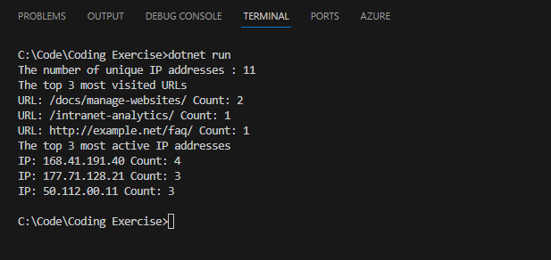

# CodingChallenge

## Description

This project is a coding exercise that reads log data from a specified file, processes it, and extracts various insights such as the number of unique IP addresses, the top 3 most visited URLs, and the top 3 most active IP addresses.

## Instructions

1. Ensure that the log file (`programming-task-example-data.log`) is located at the path: `C:\Code\Coding Exercise\Exercise\programming-task-example-data.log`.
2. Build and run the `CodingChallenge` project.

## Usage

Upon running the program, it will:

- Read the log file and extract log entries.
- Display the number of unique IP addresses.
- Display the top 3 most visited URLs along with their visit counts.
- Display the top 3 most active IP addresses along with their activity counts.

## Files

- `Program.cs`: Contains the main program logic.
- `programming-task-example-data.log`: Sample log data used for demonstration purposes.

## Note

- Ensure the log file exists at the specified path.
- The program may throw exceptions if the log file is not found or if there are any issues during file reading or data processing. Exception handling is implemented to handle such scenarios.

## Author

Oiendrila Chatterjee

## Test Result

